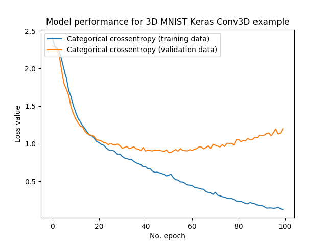

# A Simple Three Dimensional CNN Approach

This repository was create to show some techniques of Deep Learning using Conv3D for apply the 3dmnist. The result of the training can be viewed just below:

<b>Note</b>: This is one example not the <b>state-of-the-art</b>, so if you interest in this topic, you can be cloned and update the model.

#

<b>Sincerely:</b> <a href="https://github.com/neemiasbsilva">Neemias B. Silva</a>

#